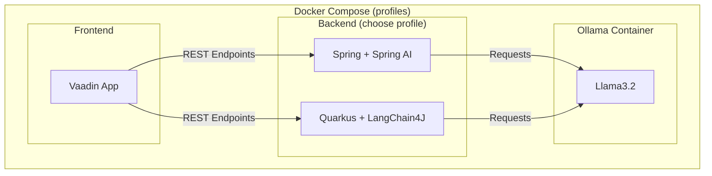

# Spring vs. Quarkus

## Spring
Start framework:
```
docker compose --profile spring up
```

[DIY Starter](https://start.spring.io/#!type=maven-project&language=java&platformVersion=3.5.6&packaging=jar&jvmVersion=25&groupId=dev.rabauer.ai.demo&artifactId=spring-backend&name=spring-backend&description=Demo%20project%20for%20Spring%20Boot&packageName=dev.rabauer.ai.demo.spring-backend&dependencies=spring-ai-ollama,web)

## Quarkus
Start framework:
```
docker compose --profile quarkus up
```

[DIY Starter](https://code.quarkus.io/?g=dev.rabauer.ai.demo&a=quarkus-backend&nc=true&e=io.quarkiverse.langchain4j%3Aquarkus-langchain4j-ollama&e=smallrye-openapi&e=rest)

## Frontend

After starting up the frontend is available at [http://localhost:8081](http://localhost:8081).

## Architecture 

