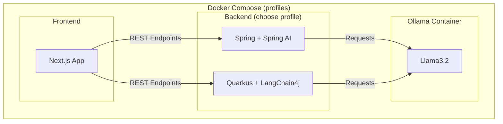

```mermaid
flowchart TD
    subgraph DockerCompose["Docker Compose (profiles)"]
        subgraph Frontend["Frontend"]
            NextJS["Next.js App"]
        end

        subgraph Backend["Backend (choose profile)"]
            Spring["Spring + Spring AI"]
            Quarkus["Quarkus + LangChain4j"]
        end

        subgraph Ollama["Ollama Container"]
            Llama["Llama3.2"]
        end
    end

    %% Connections
    NextJS -->|REST Endpoints| Spring
    NextJS -->|REST Endpoints| Quarkus

    Spring -->|Requests| Llama
    Quarkus -->|Requests| Llama
```